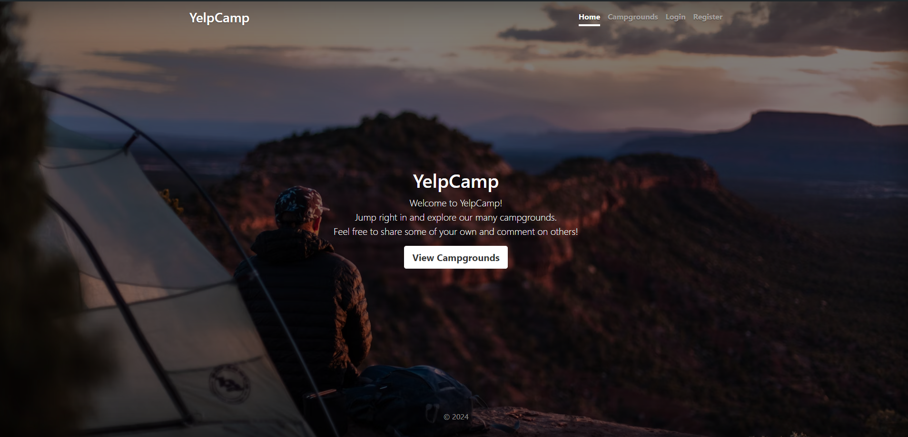
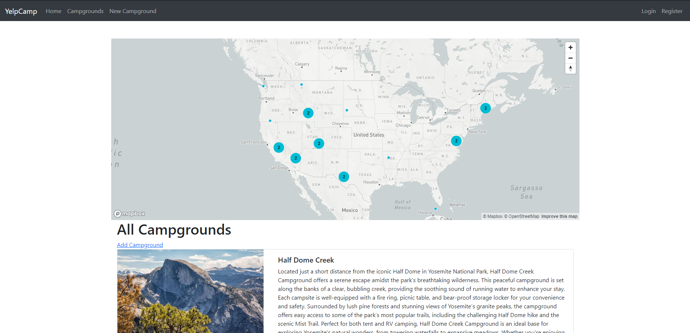
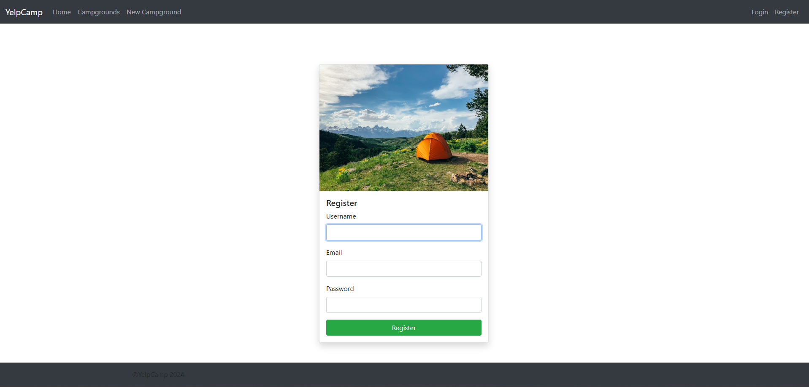
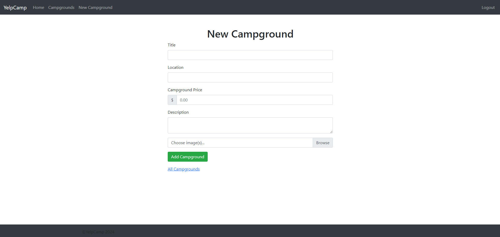
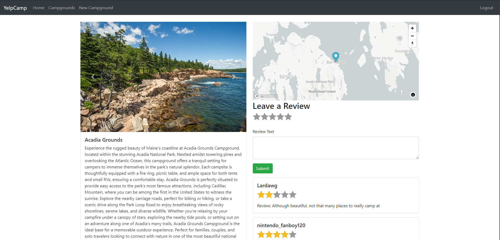

# YelpCamp

A full-stack web application that allows users to register, log in, and share their favorite campsites while leaving reviews on others' campsites. The application stores all user data in a MongoDB database and utilizes the MapBox API to visualize campground locations on an interactive map. The link to the project itself can be found [here](https://yelpcamp-d39s.onrender.com/).

## Table of Contents

- [Features](#features)
- [Demo](#demo)
- [Technologies Used](#technologies-used)
- [Installation](#installation)
- [Usage](#usage)
- [API Endpoints](#api-endpoints)
- [Contact](#contact)

## Features

- User authentication and authorization
- Add, edit, and delete campsites
- Leave reviews on campsites
- Interactive map displaying campground locations via MapBox API
- Responsive design for mobile and desktop

## Demo



This is the home screen of the application



This is the index page of campgrounds. This lists all the campgrounds uploaded so far. This page also uses the MapBox API to geocache the location of the campground and places it on an interactive map.



This is the page to register a new user into the system. The user cannot create, edit, and delete campgrounds or reviews until they register and log in.



This is the page that shows when a user creates a new campground. Each field beside the image field needs to have a value before the user can upload their campsite into the site.



This shows a specific campground with the description, price, and location. The page utilizes the MapBox API to visualize the geographical location of the campground. Additionally, the page has a section for other users to leave a rating and review.

## Technologies Used

- **Frontend:** HTML, CSS, JavaScript
- **Backend:** Node.js, Express.js
- **Database:** MongoDB
- **APIs:** MapBox API
- **Other:** Passport.js for authentication, Mongoose for database modeling

## Installation

1. Clone the repository:
   ```bash
   git clone https://github.com/yourusername/YelpCamp.git
   ```
2. Navigate into the project directory:
   ``` bash
   cd YelpCamp
   ```
3. Install dependencies
   ```
   npm install
   ```
4. Set up environment variables:
   * Create a `.env` file in the root directory and add the following variables:
     ``` .env
     DATABASE_URL=your_mongodb_connection_string
     MAPBOX_TOKEN=your_mapbox_token
     SESSION_SECRET=your_secret
     ```
5. Seed the database with sample data (optional):
   ``` bash
   node seeds/index.js
   ```

## Usage
1. Start the development server:
   ``` bash
   node app.js
   ```
2. Open your browser and navigate to `http://localhost:3000`

## API Endpoints
* **GET** /campgrounds: Retrieve all campgrounds
* **POST** /campgrounds: Upload a new campground
* **GET** /campgrounds/new: Create a new campground
* **GET** /campgrounds/:id: Retrieve a specific campground by ID
* **PUT** /campgrounds/:id: Update a specific campground by ID
* **DELETE** /campgrounds/:id: Delete a specific campground by ID
* **POST** /campgrounds/:id/reviews: Add a review to a campground
* **DELETE** /campgrounds/:id/reviews/:reviewId: Delete a review

## Contact
For any inquiries, feel free to contact me!
